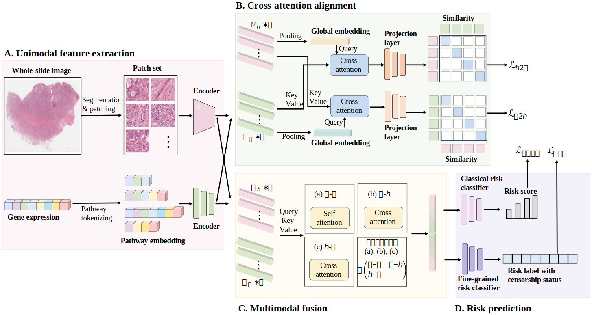

# Reliable multimodal cancer survival prediction with confidence-aware risk modeling

## Table of Contents
- [Introduction](#introduction)
- [Data Preparation](#data-preparation)
  - [Download Preprocessed Data](#download-preprocessed-data)
  - [WSIs](#wsis)
  - [Genomics](#genomics)
- [Requirements](#requirements)
- [Training & Testing](#training--testing)
- [Acknowledgements](#acknowledgements)
- [License & Citation](#license--citation)

## Introduction


Multimodal survival methods that integrate histology whole-slide images and transcriptomic profiles hold significant promise for understanding patient prognostication and guiding personalized treatment strategies. However, existing approaches primarily focus on improving predictive performance through multimodal information fusion, often neglecting the reliability estimation of the  prediction results and the inherent alignment noise across modalities. Thus, we propose ReCaSP, a novel and reliable cancer survival prediction framework that effectively integrates histology and transcriptomics data via multimodal alignment and fusion, providing the auxiliary confidence levels for survival predictions through a confidence-aware risk modeling mechanism. Specifically, our approach incorporates a fine-grained risk classifier that models risk labels jointly over multiple time intervals and censorship status, utilizing evidential deep learning to yield fine-grained risk predictions accompanied by confidence scores. Additionally, to mitigate the inherent noise in multimodal data alignment, we introduce a cross-attention alignment module that effectively aligns histology data with transcriptomics data prior to multimodal fusion, thereby facilitating cross-modal interaction learning. 

## Data Preparation
You can directly download the preprocessed features (data) provided by [PIBD](https://github.com/zylbuaa/PIBD).

Alternatively, you may preprocess the WSIs and genomics data by following the instructions below.

### Download Preprocessed Data
To download diagnostic WSIs, molecular feature data and other clinical metadata, please refer to the [NIH Genomic Data Commons Data Portal](https://portal.gdc.cancer.gov/) and the [cBioPortal](https://www.cbioportal.org/) following [SurvPath](https://github.com/mahmoodlab/SurvPath). 

### WSIs
WSI data are preprocessed using by [CLAM](https://github.com/mahmoodlab/CLAM), which provides an easy-to-use tool for WSI preprocessing. 

Since we use an SSL pretrained Swin Transformer as the encoder for WSIs, the pretrained model can be downloaded from [CTransPath](https://github.com/Xiyue-Wang/TransPath).

### Genomics
The data is downloaded from [SurvPath](https://github.com/mahmoodlab/SurvPath).

## Requirements
Set up the environment by creating a new Conda environment and installing the necessary dependencies:

```bash
conda create -n ReCaSP python=3.9
conda activate ReCaSP
conda install pytorch==2.0.0 torchvision==0.15.0 torchaudio==2.0.0 pytorch-cuda=11.8 -c pytorch -c nvidia
conda install scikit-learn
pip install einops
pip install scikit-survival
pip install transformers
```

## Training & Testing
To train and test the model, run the following command with the appropriate parameters:

```bash
# train the model
python main.py --gpu 2 --study 'blca' --weighted_sample --beta_surv 0.3 --reg_loss_alpha 0.1
# test the model using the saved model (XXXX is timestamp of the saved model)
python main.py --gpu 2 --study 'blca' --only_test --weighted_sample --beta_surv 0.3 --reg_loss_alpha 0.1 --dt 'XXXX'
```

## Acknowledgements
We would like to thank the following repositories for their great works:
- [CLAM](https://github.com/mahmoodlab/CLAM)
- [CTransPath](https://github.com/Xiyue-Wang/TransPath)
- [SurvPath](https://github.com/mahmoodlab/SurvPath)
- [PIBD](https://github.com/zylbuaa/PIBD)

## License & Citation
This project is licensed under the Apache-2.0 License.
If you find our work useful in your research, please consider citing our paper at:

```plaintext
Xie et al. (2025). *Reliable multimodal cancer survival prediction with confidence-aware risk modeling*. XXX Journal.
```